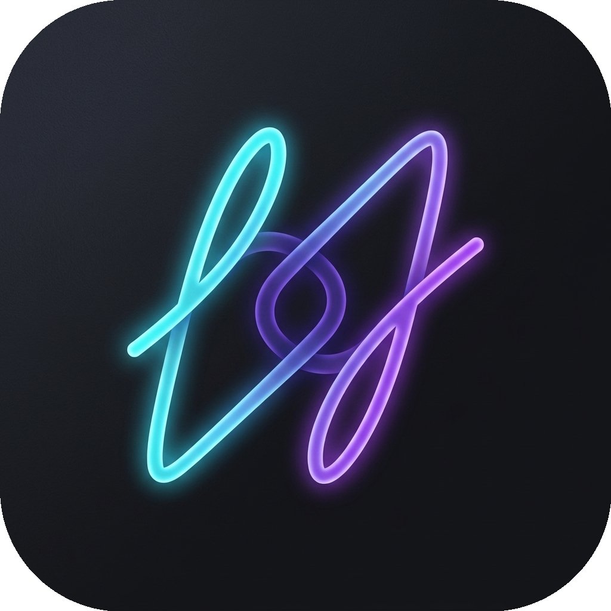

# Liquid Loop

**Аудиоплеер для музыкантов с функцией бесшовного A-B зацикливания.**

[Скачать APK](https://github.com/liqtranq/liquid-loop/releases)

## О проекте
Liquid Loop создан для комфортной работы с лупами (повторяющимися фрагментами аудио). Выберите нужный участок трека, и приложение будет проигрывать его по кругу без пауз и щелчков. Это удобный инструмент для репетиций, написания текста под минус или съёма инструментальных партий на слух.

## Возможности
- **Бесшовный A-B Лупинг:** Плавный возврат на начало отрезка благодаря алгоритму микрофейдов (сглаживание границ аудио).
- **Интерактивная волна (Waveform):** Наглядная навигация и точный выбор границ фрагмента пальцем.
- **Умная сетка (Grid & Snap):** Привязка лупа к музыкальной сетке (1 бар, 1/2, 1/4) с расчетом BPM и размерности.
- **Настройка скорости и питча:** Замедление трека без изменения тональности (Time-stretch) и изменение высоты тона (Pitch-shift).
- **Фоновый режим:** Приложение продолжает играть и держать луп, даже если вы свернули его, чтобы открыть текст песни или ноты.

## Установка
Скачайте актуальный `apk` файл на странице [Releases](https://github.com/liqtranq/liquid-loop/releases) и установите на свой Android-смартфон (требуется Android 8.0+).
